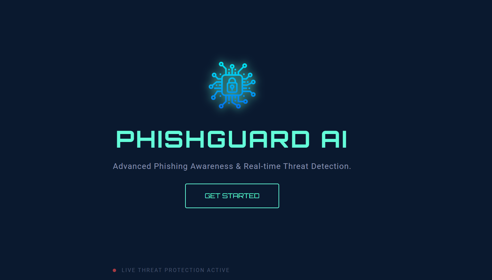
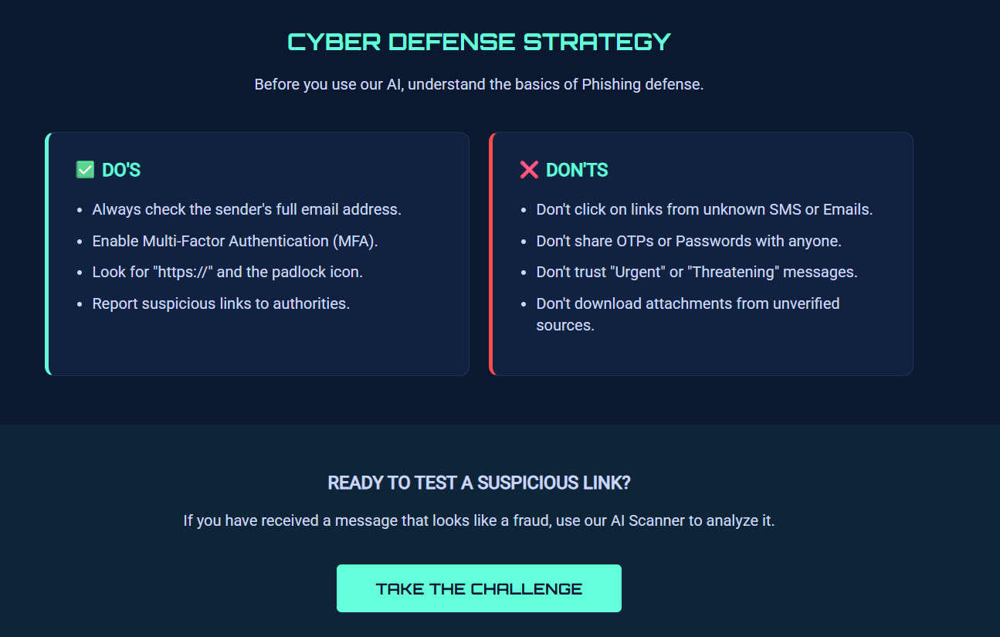
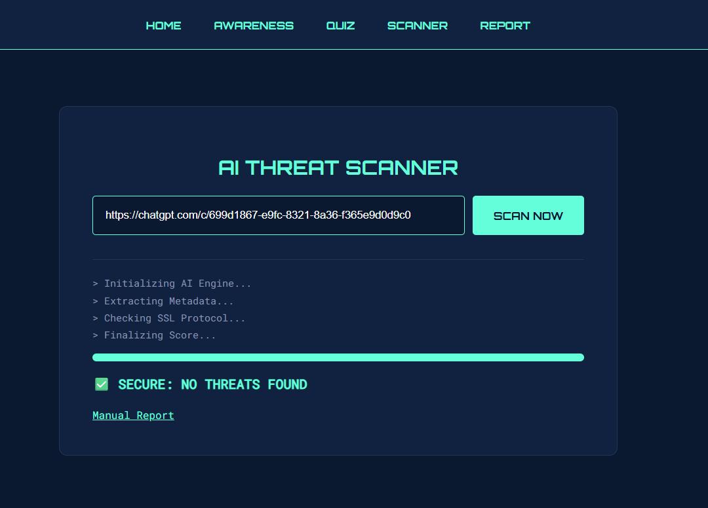

# PhishGuard AI
Smart phishing awareness and real-time threat detection made simple.

# Problem
Phishing attacks are increasing rapidly, and many users still struggle to identify fake links and malicious websites. Most tools available today are either too technical for beginners or focus only on detection without educating the user.

Because of this gap, everyday users remain vulnerable to scams, credential theft, and online fraud.

# Solution
PhishGuard AI is a user-friendly cybersecurity platform that combines phishing awareness with a detection-ready interface. It helps users learn safe browsing practices while also guiding them to identify suspicious links in an interactive way.

The platform focuses on prevention, clarity, and accessibility so that even non-technical users can stay protected online.

# Key Features
Phishing Awareness Module  
Suspicious Link Scanner  
Real-time Protection Indicator    
Modern Cybersecurity UI  
Beginner-Friendly Navigation  
Scalable for future AI integration  

# Screenshots

# Landing Page

# Awareness Module

# Link Scanner

# Project Structure
PhishGuard-AI/
│── index.html
│── about.html
│── awareness.html
│── feedback.html
│── quiz.html
│── report.html
│── scanner.html
│── tech.html
│── tips.html
│── trends.html
│── css/
│   └── style.css
│── js/
│   └── script.js
└── screenshots/

# Tech Stack
- HTML5  
- CSS3  
- JavaScript  
- Live Server  

# Run Locally
1. Clone the repository  
2. Open the project folder  
3. Run index.html using Live Server  
4. Use the platform in your browser  

# Future Scope
- Real AI phishing URL detection  
- Threat confidence scoring  
- User login system  
- Browser extension  
- Mobile responsiveness improvements  
- Integration with threat intelligence APIs  

# TEAM - THREATOPS
pragya lodhi 
Sweksha Kakkar  
sonam
